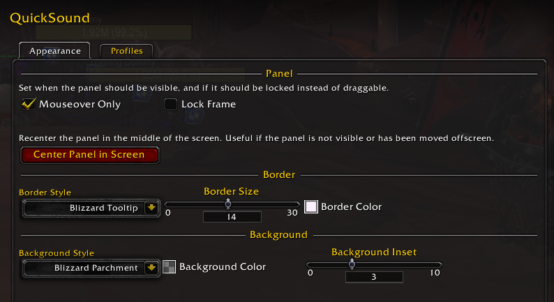
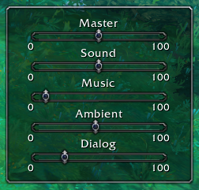
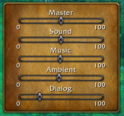
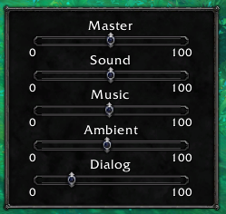
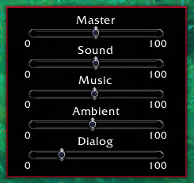

# QuickSound
An addon for World of Warcraft that adds a hoverable sound panel for quickly adjusting game volumes. 

## Requesting Features/Contributing
If you have any features you'd like added, head on over to the issues page and let me know! If you'd like to contribute to development directly, you can clone the repo and build the project using the [Big Wigs Mods' packager](https://github.com/BigWigsMods/packager) (See their recommendation for [setting up the packager locally](https://github.com/BigWigsMods/packager).)
